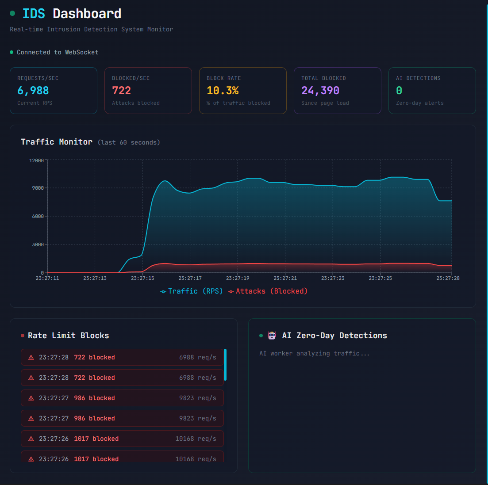

# 🛡️ High-Performance Intrusion Detection System

A real-time, AI-powered Intrusion Detection System built with **Go**, **Python**, and **Next.js**.



## ✨ Features

| Component | Technology | Purpose |
|-----------|------------|---------|
| **gRPC Server** | Go | Bi-directional streaming, 50K+ req/s |
| **Rate Limiter** | Redis + Lua | Atomic sliding window, L1/L2 caching |
| **Signature Validation** | HMAC-SHA256 | Request integrity verification |
| **AI Detector** | Python + IsolationForest | Zero-day anomaly detection |
| **Dashboard** | Next.js + Recharts | Real-time WebSocket visualization |

## 🏗️ Architecture

```
┌─────────────┐     gRPC Stream      ┌─────────────────┐
│   Client    │◄────────────────────►│   Go Server     │
│ (Attacker)  │                      │   :50051        │
└─────────────┘                      └────────┬────────┘
                                              │
                    ┌─────────────────────────┼─────────────────────────┐
                    │                         │                         │
                    ▼                         ▼                         ▼
            ┌───────────────┐       ┌─────────────────┐       ┌─────────────────┐
            │  Redis        │       │  AI Worker      │       │  WebSocket      │
            │  Rate Limit   │       │  (Python)       │       │  :8080          │
            │  L2 Cache     │       │  IsolationForest│       └────────┬────────┘
            └───────────────┘       └─────────────────┘                │
                                                                       ▼
                                                              ┌─────────────────┐
                                                              │  Dashboard      │
                                                              │  Next.js :3000  │
                                                              └─────────────────┘
```

## 🚀 Quick Start

### Prerequisites
- Go 1.21+
- Python 3.9+
- Node.js 18+
- Redis (or Docker)

### 1. Start Redis
```bash
docker run -d -p 6379:6379 redis:alpine
```

### 2. Generate Protobuf
```bash
protoc --go_out=. --go_opt=paths=source_relative \
       --go-grpc_out=. --go-grpc_opt=paths=source_relative \
       proto/intrusion.proto
```

### 3. Run Components

| Terminal | Command |
|----------|---------|
| **1** | `go run server/main.go` |
| **2** | `cd ai-worker && pip install -r requirements.txt && python main.py` |
| **3** | `cd dashboard && npm install && npm run dev` |
| **4** | `go run client/main.go` |

### 4. Open Dashboard
Navigate to **http://localhost:3000**

## 📊 Detection Capabilities

| Attack Type | Detection Method | Response |
|-------------|------------------|----------|
| Rate Limit Abuse | Redis sliding window (100 req/10s) | `BLOCKED_RATE_LIMIT` |
| Signature Tampering | HMAC-SHA256 validation | `BLOCKED_INVALID_SIG` |
| Zero-Day Patterns | IsolationForest ML | AI Alert to Dashboard |

## 🔧 Configuration

### Server (`server/main.go`)
```go
rateLimit       = 100              // requests per window
rateLimitWindow = 10 * time.Second // window duration
localBlockTTL   = 60 * time.Second // L1 cache TTL
```

### AI Worker (`ai-worker/main.py`)
```python
BUFFER_SIZE = 1000       # Training samples
RETRAIN_INTERVAL = 100   # Retrain frequency
CONTAMINATION = 0.01     # Expected anomaly rate (1%)
```

## 📁 Project Structure

```
intrusiondetection/
├── proto/              # Protobuf definitions
│   └── intrusion.proto
├── server/             # Go gRPC server
│   └── main.go
├── client/             # DDoS simulator
│   └── main.go
├── ai-worker/          # Python ML worker
│   ├── main.py
│   └── requirements.txt
├── dashboard/          # Next.js frontend
│   ├── app/
│   └── components/
└── docs/               # Screenshots
    └── dashboard.png
```

## 📈 Performance

- **Throughput**: 50,000+ requests/second
- **Latency**: <1ms (L1 cache hit), <5ms (Redis)
- **Memory**: L1 cache reduces Redis calls by 80%

